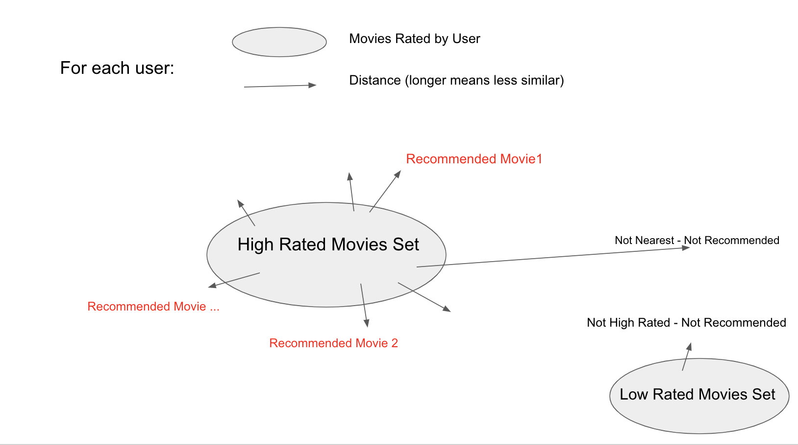
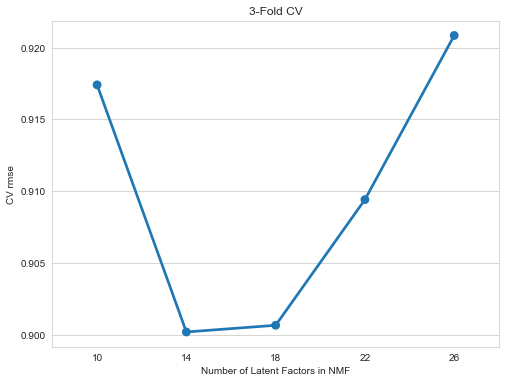
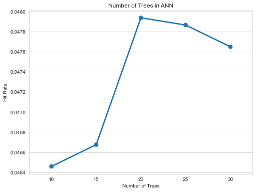
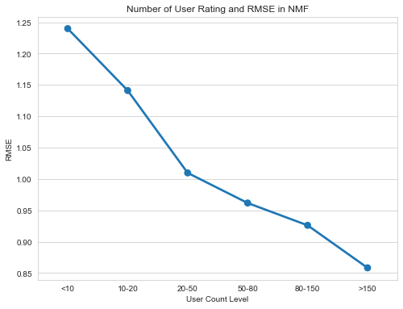
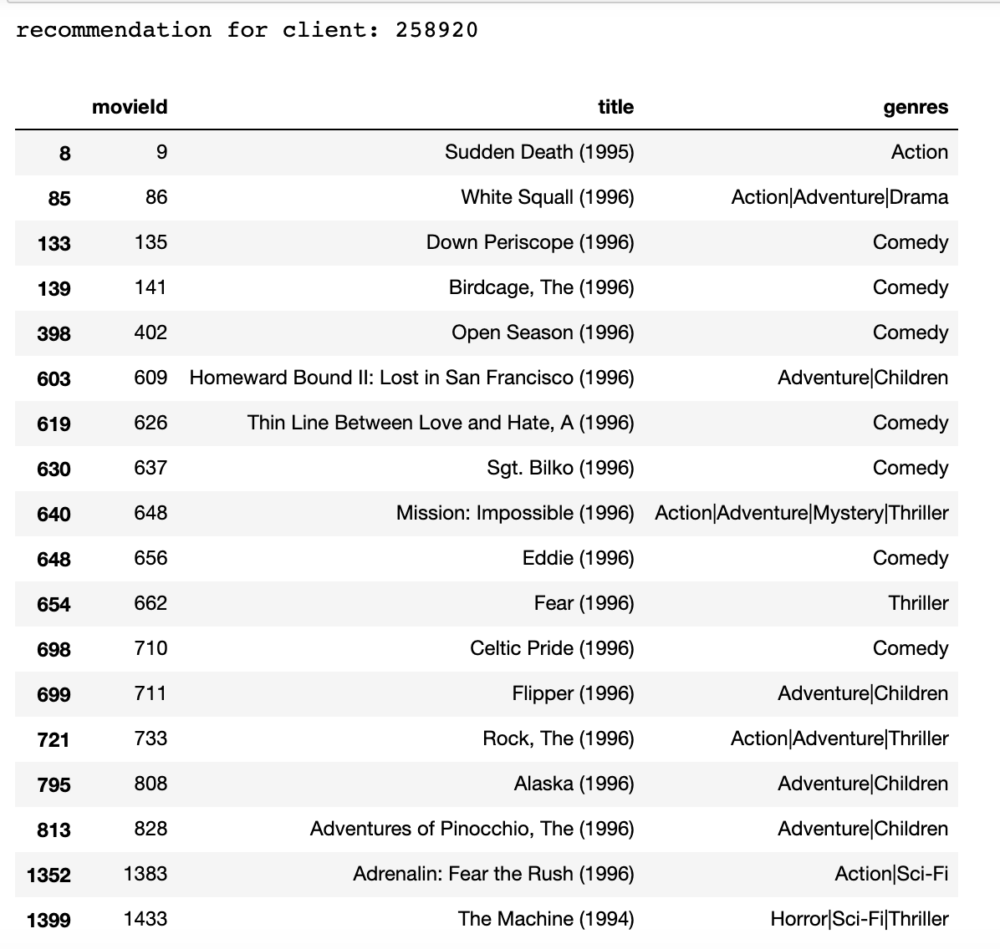

# Nonnegative Matrix Factorization with Approximate Nearest Neighborhood
## Model Description:
* NMF (Nonnegative Matrix Factorization) is a matrix factorization method where the matrices are constrained to be nonnegative. The objective is to factorizes a huge user-item interaction matrix into two smaller rank matrices sharing a joint latent vector space, i.e., find two non-negative matrices (U, V) whose product approximates the non-negative matrix R. 
* Since matrix factorization maps all entity types (e.g. users and items) into the same latent space, the item vector consists of the movies vector representation.  After running matrix factorization algorithms, every item can be represented as a vector in f-dimensional space. Annoy package then helps to search for similar items through Approximate Nearest Neighborhood method. 
* In the way of selecting neighbor movies, we start from the list of high-scored movies that are rated by given users. We use 2 as the rating threshold in the default setting, indicating that if a certain movie’s rating standardized by user preference is above 2 it would be labeled as ‘relevant/favorite’. We select the movies that are nearest to the high rated movies.

## Parameters Tuning:
* Num_Components: Number of latent factors in NMF, default as 15
* Distance_Metric: Distance Metric in ANN method: can be "angular", "euclidean", "manhattan", "hamming", default as 'angular'
* Num_Trees: Number of trees in the index, default as 20
* K: Top K items to be recommended to a user, default as 10
* Threshold: Rating threshold, default as 2

Constrained by time and space, We only tried to implement different Number of latent factors and number of trees in the index. In the way of tuning Num_components, the evaluation metric we used is RMSE computed from NMF decomposition:
`Num_Component = [10, 14, 18, 22, 26]` 

In the way of tuning Num_Trees, the evaluation metric we used is Hit rate given that we generated the recommendation list for each user:
`trees = [10, 15, 20, 25, 30]`

## Optimal Model:
To choose the optimal number of latent factors in non-negative matrix factorization, we use 3 fold cross-validation.

As shown in the cross validation graph, at Num_Components = 14, Nonnegative Matrix Factorization achieves lowest RMSE.

Below graph shows how hit rate in the train set varies by different number of trees.

As shown in the graph, at Num_trees = 20, the recommendation system has relatively high hit rate. But also note that the hit rate is still relatively low probably because we only employ 10% of the dataset.

Our parameters were tuned in the [following code](MF_ANN_Model.ipynb). THe choice for the parameters are:
*Num_Components = 14*, *Distance_Metric = 'angular'*, *Num_Trees = 20*, *K = 10*, *Threshold = 2*

The current choice of parameters in the NMF decomposition give a RMSE of 0.8846 in the test set. Please check details in the [following code](MF_ANN_Model.ipynb).

We also computed the RMSE of the above model across different user groups: 

for users give less than 10 ratings, between 10-20 ratings .... greater than 150 ratings

`user_count_levels = '<10', '10-20', '20-50', '50-80', '80-150', '>150'`

As shown in the graph, RMSE reduces as user give more ratings.

## Result:
For any user in the dataset, the Nonnegative Matrix Factorization with Approximate Nearest Neighborhood method will recommend a list of 20 movies.

For example, randomly choose a user in the sample dataset: In this case, when userid = 258920, this NMF with ANN recommendation algorithm will suggest the following movies:

`client_id = int(np.random.choice(sample_df.userId.unique(), 1)) ` 
 `print(f'recommendation for client: {client_id}')`  
 `movies = recommendationn_list[client_id]`  
 `movie_dt.loc[movie_dt['movieId'].isin(movies)]`
 

## Requirement and Package:
Java version : 13.0.2

Python version : 3.8.5

Annoy version : 1.17.0

Scikit-Learn version: 0.23.2

Surprise Package
