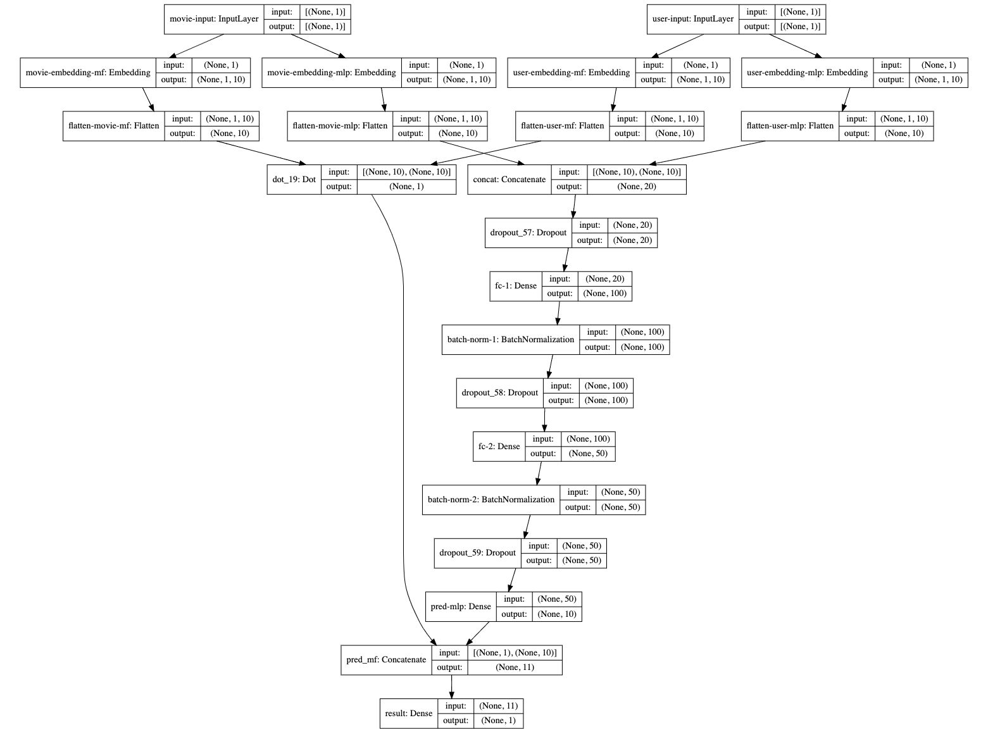
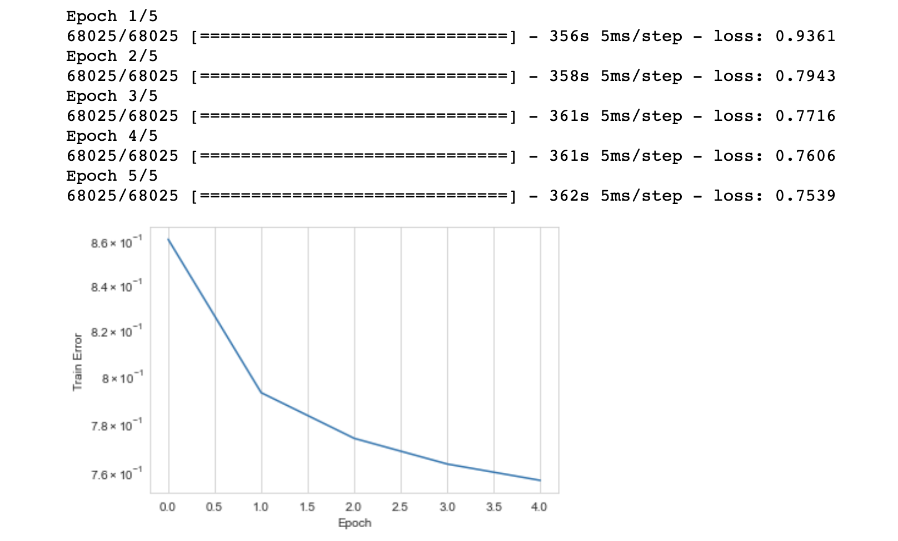
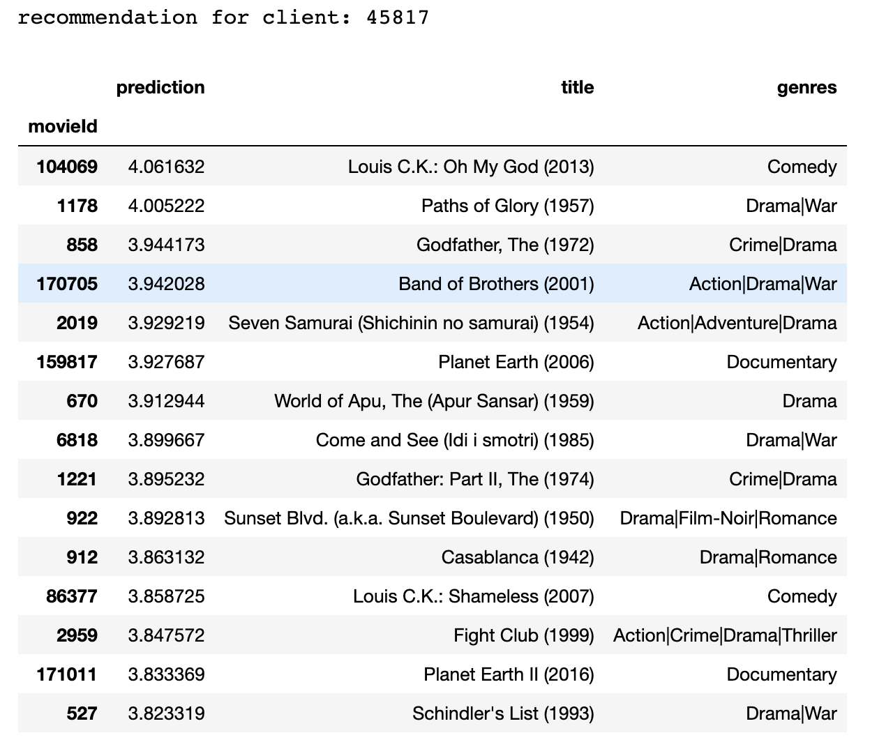
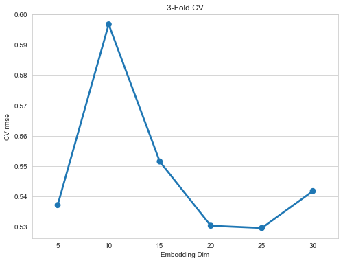
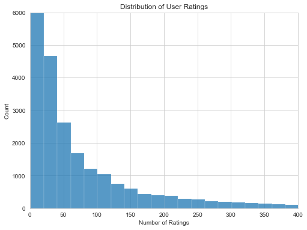
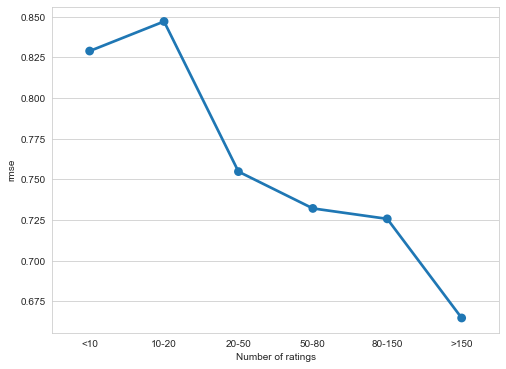

## Model 1: Neural Collaborative Filtering
### Model Description
Collaborative filtering is traditionally done with similarity matrix or matrix factorization, however, the paper *Neural Collaborative Filtering* (2017) brings us a new vision of developing a deep learning architecture combining both embedding and and tensor layers to solve the recommendation problem. The architecture of neural collaborative filtering (NCF) model consists of four parts: user, item embedding, generalized matrix factorization (GMF), multilayer perceptrons (MLPs) and a concatenation layer. 

### NCF Architecture
Following the instruction of that paper, I constructed GMF and MLP embedding layers for both users and items. One of the advantages of embedding layers than pure item-user matrix is we can define space holders for users who did not appear in the training set and movies which were not rated by any user in training. Following the embedding layers, two concatenation layers combine user embedding and item embedding seperately for GMF and MLP. Each MLP layer uses relu activation function and followed with batch normalization and drop-out regularization. Batch normalization ensures the stability of input to next layer, while drop-out regularization with probability of 20% is added to prevent overfitting issue. Input dimension of first MLP layer is same as latent dimension of embedding matrix, while the output is 100. Output dimension of second MLP layer is 50. The entire structure of our NCF model is shown as below figure. 

### Training Performance 
NCF parameters:
* Dimension of embedding layer: 20
* Number of epoch: 5
* Learning rate: 0.01
* Loss function: root mean square error
* Mini-batch size: 64
* Optimizer: Adam optimizer

Five iteration is enough for model training since the gradient of loss curve is close to zero after the third iteration. We use rooted mean square error as loss function. From the epoch-loss graph, we can perceive this model ends with training rmse of 0.75 which is much better than either MF or collaborative. The rmse of NCF model on testing set is 0.73, slightly smaller than the training, indicating we do not need to concern about overfitting issue. 

### Hyperparameter Optimization
In previous section, we have observed that number of epoch is not the main issue limiting model performance. Learning rate and dimension of embedding layer are possible direction of optimization. Since learning rate 0.01 is a commonly used for neural network training, we will primarily focus on finding optimized value for embedding layer size. We tried five difference sizes and found out models with embedding layer size of 20 and 25 performs better than other values in a 3-fold cross-validation. More dimensions of embedding matrix indicates less error on training but a loss of generality, therefore, we choose to set embedding layer size as 20 for pre-trained NCF model. 

### Model Exploration: performance on Inactive/Active Users
The distribution of user rating counts indicates over half of users have rated less than 50 movies. Recommender system may suffer higher error or bias when given user is inactive (have limited records). Therefore, it is important to check the performance of NCF model on inactive or active user. We splited user into six groups, those who have rated less than 10, from 10 to 20, from 20 to 50, from 50 to 80, from 80 to 150 and over 150. 

The insteresting fact is the prediction of our NCF model has smaller rmse on user who has rated less than 10 movies than those who has rated between 10 and 20 movies. Since there are over one hundred thousands records for each of these two groups, this finding is reliable. Overall, in the worst case scenario, rmse of NCF model is still higher than MF-ANN, traditional collaborative filtering and baseline models. 

