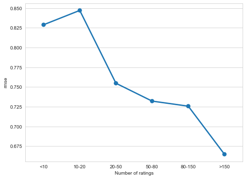
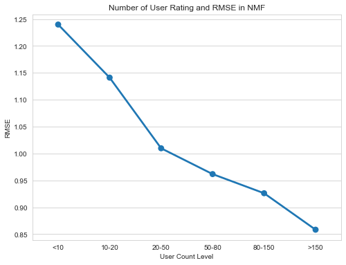

# Final Project: Top 20 Movies Hybrid Recommendation System
### Team Members: 
Nan Tang, Tianqi Lou, Chenxi Di

## Indexing
* [Hybrid System (Python class for recommendation)](Hybrid_System.ipynb)
* [Neural Collaborative Filtering Model (notebook)](NCF-model.ipynb)
* [NCF Model Development & Exploration (markdown file)](NCF_Model.md)
* [Matrix Factorization & Approximate Nearest Neighbors Model (notebook)](MF_ANN_Model.ipynb)
* [NMF-ANN Model Development & Exploration (markdown file)](MF_ANN_Model.md)
* [Baseline Bias Model (notebook)](baseline_bias_model.ipynb)
* [Item-based Collaborative Filtering Model (notebook)](Item_based_CF_model.ipynb)

## Business Objective:
Movie recommendation systems provide users with a mechanism assistance in classifying them with similar interests. This makes recommender systems essentially a central part of websites and e-commerce applications. Our primary business objective is to maximize movie website engagement, that is, to increase user usage on the movie platform through actively suggest possible interested movies. In the perspective of advertising, our purpose is to increase the click through rate of email promotions by recommending attractive movies.

Two tools we include in this hybrid recommendation system are Deep Learning and Collaborative Filtering. Our goal is to find top 20 recommened movies for each user in the dataset, so that users can actively use it to review new movies. Since we hope to make more personalized recommendation to each users, our objective is then focused on the user rating history given we do not have enough user information. (We were only given user age and gender.) In other words, this hybrid recommendation system cannot give recommendations to users that have not rated any movies. 

## About Data:
25 million ratings applied to 62,000 movies by 162,000 users. Released 12/2019 on https://grouplens.org/datasets/movielens/.
Below figure shows the distribution of ratings per movie. Of the 2,83,228 users using Movies, around 69,000 people rated more then 100 movies. Most of the movies in the data received less than 10000 ratings. 

  

Below shows the distribution of average rating scores per user. Most users give ratings between 3 and 5.

  

The Popularity graph follows a long tail distibution which suggests that more Popular movies are more likely to receive more ratings.

  

Distribution of user rating count implies almost half of the users have rated less than 50 movies. Making recommendation for users (inactive) with few history records is more challenging than for active ones. 

  

## Model Description:
### Algorithm 1: Neural Collaborative Filtering 
For all details (Architecture, Training, Optimization, Model Exploration), please visit:

[Neural Collaborative Filtering Model](NCF_Model.md)

Collaborative filtering is traditionally done with similarity matrix or matrix factorization, however, the paper Neural Collaborative Filtering (2017) brings us a new vision of developing a deep learning architecture combining both embedding and and tensor layers to solve the recommendation problem. The architecture of neural collaborative filtering (NCF) model consists of four parts: user, item embedding, generalized matrix factorization (GMF), multilayer perceptrons (MLPs) and a concatenation layer.

NCF model architecture 

  

The distribution of user rating counts indicates over half of users have rated less than 50 movies. Recommender system may suffer higher error or bias when given user is inactive (have limited records). Therefore, it is important to check the performance of NCF model on inactive or active user. We splited user into six groups, those who have rated less than 10, from 10 to 20, from 20 to 50, from 50 to 80, from 80 to 150 and over 150. 

NCF Performance on active/inactive users:

  

### Algorithm 2: Matrix Factorization with Approximate Nearest Neighborhood Model
For all details(Model Description, Parameter Tuning, Model Evaluation), please visit:

[Matrix Factorization with Approximate Nearest Neighborhood Model](MF_ANN_Model.md)

* NMF (Nonnegative Matrix Factorization) is a matrix factorization method where the matrices are constrained to be nonnegative. The objective is to factorizes a huge user-item interaction matrix into two smaller rank matrices sharing a joint latent vector space, i.e., find two non-negative matrices (U, V) whose product approximates the non-negative matrix R.

* Since matrix factorization maps all entity types (e.g. users and items) into the same latent space, the item vector consists of the movies vector representation. After running matrix factorization algorithms, every item can be represented as a vector in f-dimensional space. Annoy package then helps to search for similar items through Approximate Nearest Neighborhood method.

* In the way of selecting neighbor movies, we start from the list of high-scored movies that are rated by given users. We use 2 as the rating threshold in the default setting, indicating that if a certain movie’s rating standardized by user preference is above 2 it would be labeled as ‘relevant/favorite’. We select the movies that are nearest to the high rated movies.

  

Since the recommender system may suffer higher error or bias when given user is inactive (have limited records). We check the performance of NMF model on inactive or active user. 

NMF-ANN Performance on active/inactive users:

  

Current offline accuracy scores include hit rate and root mean squared error. 

* RMSE: It measures the difference between actual value(rating) and the predicted value. The lower the RMSE suggests a possible better model. 

* Hit Rate: HIT RATE = (HITS IN TEST) / (NUMBER OF USERS). To measure a Hit Rate, we generate top 10 recommendations for all the users in test dataset. If generated recommendation list contains something that users rated, then that counts as 1 hit. Greater the Hit Rate suggests a possible better model. 

In order to further evaluate the model performance, we suggest incorporating more implicit feedback or users’ reaction to our recommendations, including browsing history, search patterns, or even mouse movements.

### Algorithm 3: Baseline Bias Model

The baseline bias model is widely used for comparing with other models. It provides the basic prediction by filling the user-item matrix with the following formula.

  

At first we built a bias model on our own,(see comment in baseline_bias_model.ipynb for detail), but the algorithm is extremely space and time consuming. So we decided to use the existing baseline model from surprise. It predicts each entry by a slightly different formula, but accomplishes the same task much more efficiently.

### Hybrid-System
Constrained by runtime, we did not employ the full dataset. We randomly chose 10% of the users and implement a switching model where users are funneled into different recommendation algorithm depending on their profile. Users with a moderate amount of ratings may be funneled into a Matrix Factorization with Approximate Nearest Neighborhood Model, while users with a lot of ratings are funneled into a Deep Learning Model.

Challenges for a powerful recommender system include the trade-off between accuracy and novelty, efficiency, and cold-start problem. A hybrid system is designed to improve model performance on these challenges. Considering the high accuracy of NCF model, the coverage of MF-ANN model and the efficiency of Most Popular recommendation, we combined three different algorithms in our hybrid system based on the user profile. 

* For new user (cold-start),  recommend top-k movies with highest rating and most ratings
* For user who rated less than 50 movies, recommend with NCF model only
* For user who rated more than 51 movies but less than 150, recommend with both NCF and ANN model, with heavier weight on NCF model
* For user who rated more than 151 movies, recommend with both NCF and ANN models, and their weights are equally assigned

Since our model primarily focuses on existing users, we recommend most popular and highest rated movies for new users for simplicity. We explored the performance of NCF and MF-ANN models on users with different levels of participation and found that the NCF model over-perform all other models when user profile is limited. Therefore, we give more weight to NCF model when recommending for users who have rated less than 150 movies. 

  

This sample shows a ranked recommendation for user id = 14. The list of movie includes 14 differnt genres among all 21 categories. Several contradictory genres are recommended, therefore, in the asepect of genre, the serendipity requirement of our hybrid system is satisfied. 

### Hybrid-System Evaluation

In this evaluation part, we applied two metrics, root mean square error for models whose output includes numerical prediction score, and NDCG for ranked recommendations.  Sample size for DCG score is 100; ranking is from 1 to 20 (DCG@20); 0 and 1 as relevance scores (all relevance scores will be encoded as 1). Table below listed evaluation scores for hybrid system, its support models and two baseline models.

|  | RMSE (test) | DCG@20 |
| -- | -- | -- |
| Hybrid-System | N/A | 0.8399 |
| NCF | 0.7301 | 0.9523 |
| NMF-ANN | 0.8846 | 0.7967 |
| Baseline Bias | 0.8750 | 0.8760 |
| CF | 0.9098 | 0.9362 | 

A few things to be noticed: 
* It is too complicated to calculate RMSE for the hybrid system, therefore, we just calculated the NDCG score 
* Our recommendation system will never recommend movies that have been watched by the user. However, in order to calculate NDCG scores, we applied some modifications, thereby the ranked recommendation will include movies that have been rated by user. 
* RMSE score for NMF-ANN is achieved by using NMF only

## Discussion:
Improvement could be done on scalability and run time. As the count of users and movies increases, the rating matrix we need to handle in the memory based approach has many values being 0. Such a sparse matrix costs lots of space and run time. As discussed in the model based approach, the hyperparameters we employed probably have not captured enough features in the data, which further results in reduced accuracy. In addition, in the way of designing hybrid system, we focus more on accuracy on the prediction so we give more weight on NCF model and choose only the top rank predictions. We could further add some unfamilar recommendations for users and consider using timestamp to improve the system in the serendipity aspect. In the future, we also seek to incorporate more item information into our model. 

## Requirement: 
Environment and Packages:
* Java version : 13.0.2
* Python version : 3.8 
* Annoy version : 1.17.0
* Scikit-Learn version: 0.23.2
* Keras 2.0
* Surprise, Tensorflow
Above environment ensures one can load pre-trained models

Pre-trained Models:
* dl_model.h5
* nmf_model.sav
* rating.ann

## Reference:
Please check requirement files in the seperate .md files.

Recommendation System Evaluation Metrics, Rishabh Bhatia, Mar 18, 2019, https://medium.com/@rishabhbhatia315/recommendation-system-evaluation-metrics-3f6739288870

Recommender System with Collaborative filtering algorithm (MovieLens 100k dataset), https://github.com/nicolasfguillaume/Recommender-Systems-Making-Movies-Recommendation/blob/master/MovieLens%20(NMF)%20v1.ipynb

Neural Collaborative Filtering, Xiangnan He, Lizi Liao, Aug 26, 2017, https://www.comp.nus.edu.sg/~xiangnan/papers/ncf.pdf
